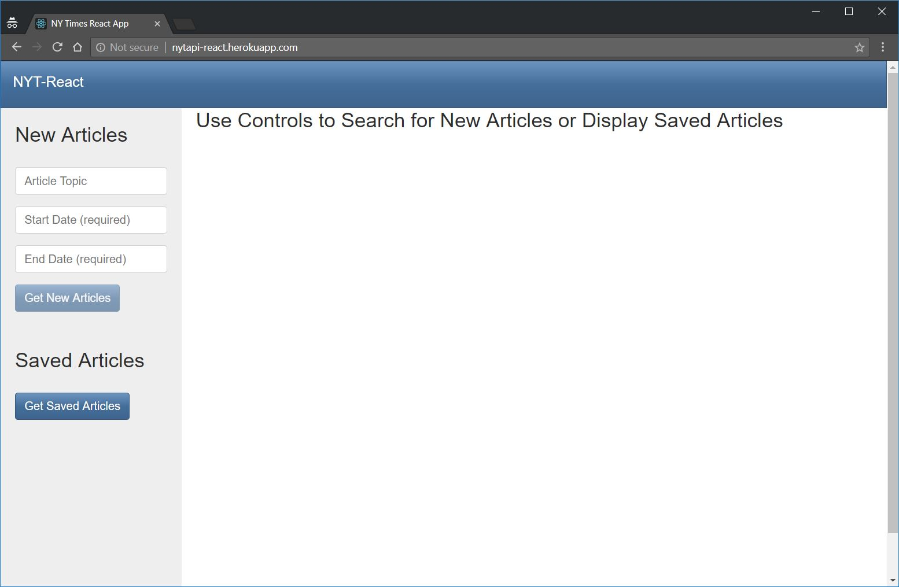
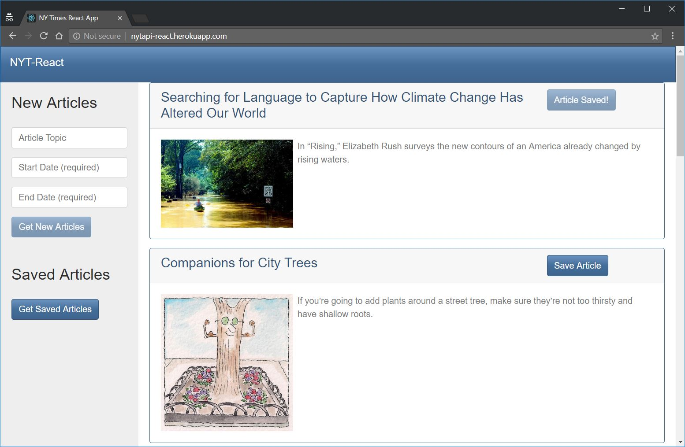
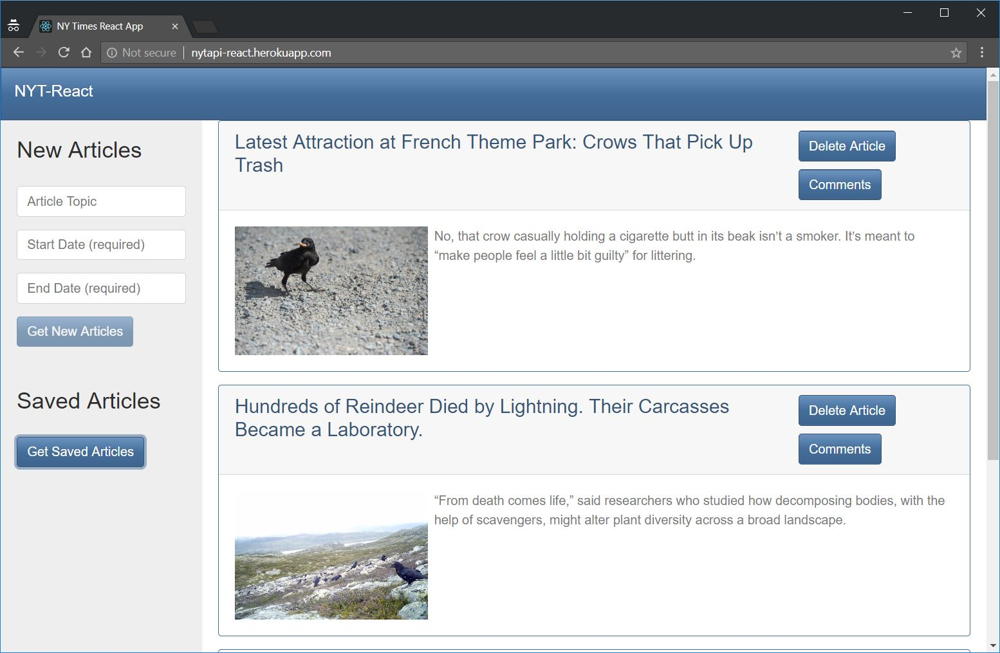
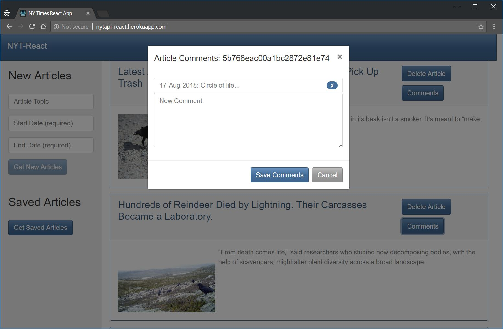

# NY Times API React Application

This application uses the NY Times API to retrieve articles from [The NY Times](https://www.nytimes.com) based on a user's input. It allows users to save articles to a MongoDB and allows comments to be attached to the saved articles.

### Instructions

1. The application is located as follows:

   * Heroku deployment: [The NY Times API React App](https://nytapi-react.herokuapp.com/)

   * GitHub repository: [The NY Times API React App GitHub Repository](https://github.com/bpzimmerman/nytreact)

#### New Articles

1. First the user inputs must be entered. A 'Topic' is optional, but a 'Start Date' and 'End Date' must be selected.

2. Selecting a 'Start Date' and 'End Date' will enable the `New Articles` button and clicking it will query the NY Times API for articles meeting the input criteria. The page will display the headlines linked to the full story on The NY Times website. A picture (if available) and summary of the article are also displayed.

3. Clicking the `Save Article` button next to the article headline will save the article's information into a Mongo Database.

#### Saved Articles

1. Clicking the `Saved Articles` button will pull the saved information from the Mongo Database and display the articles as before except with two buttons: `Delete Article` and `Comments`.

2. Clicking the `Delete Article` button will remove the article and all associated comments from the database.

#### Comments

1. Clicking the `Comments` button will open a modal that will allow the user to add a comment to the article. Multiple comments can be associated with the same article and will display in a list just above the new comment text box.

2. Clicking the `x` next to the comment will remove just that comment from the database.
